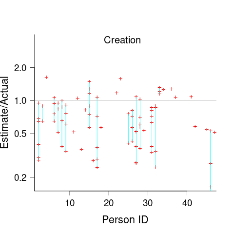

The CESAW dataset: a conversation
=================================
:author:    Derek M. Jones
:email:    derek@knosof.co.uk
:copyright: Somebody
:backend:   slidy
:max-width: 45em

About me
--------

{nbsp}

Knowledge Software

{nbsp}

Compiler front ends+code optimizers/generators

{nbsp}

Source code analysis

{nbsp}

Industrial research around SE

{nbsp}

Finding me

* Twitter: @evidenceSE
* https://discord.gg/EQm5Hucf
* derek@knosof.co.uk
* London based

Book
----

Evidence-based Software Engineering based on the publicly available data +
pdf+code+all data freely available http://knosof.co.uk/ESEUR

[caption="Figure ", label=ESEUR-Cover.jpg]
image::ESEUR-Cover.jpg[height=650,width=500,align="center"]

Slides+data
-----------

{nbsp}

Github

* https://github.com/Derek-Jones

{nbsp}

book: Evidence-Based Software Engineering

* http://www.knosof.co.uk/ESEUR

{nbsp}

blog: Shape of code

* https://shape-of-code.com

Overview
--------

{nbsp}

Effort estimation of software tasks

{nbsp}

State of art before paper published

{nbsp}

Paper we Love +
The CESAW dataset: a conversation +
Derek M. Jones and William R. Nichols

{nbsp}

State of art after paper+data published

Before paper published
----------------------

Effort estimation of software tasks

* Quoting for external work

** Competing against others
** Bid low to win the contract, recoup by charging for unplanned work

* Internal project
** Not usually a competitive environment
** If estimate not accepted, other work available
** Impress management: estimate high, deliver under budget

Minuscule datasets

* Most less than 100 rows +
[small]'https://github.com/Derek-Jones/Software-estimation-datasets'
* Models: COCOMO, Putnam +
[small]'https://shape-of-code.com/2016/05/19/cocomo-how-not-to-fit-a-model-to-data/'
* Machine learning

Software effort estimation mostly fake research
-----------------------------------------------

{nbsp}

Machine learning on minuscule datasets

Public datasets +
[small]'Public datasets Review of Existing Datasets Used for Software Effort Estimation, by Rahman, Gonçalves, Sarwar' +
[small]'https://github.com/Derek-Jones/Software-estimation-datasets'

* Albrecht 24 rows, 1980
* COCOMO 63 rows, 1981
* NASA 18 rows, 1981
* Desharnais 81 rows, 1989
* China 499 rows, 2010

Currently lost data

* Data & Analysis Center for Software (DACS) +
[small]'https://shape-of-code.com/2017/02/19/dacs-software-life-cycle-empiricalexperience-database/'

Data explosion since 2019
-------------------------

{nbsp}

SiP effort estimation dataset

* One company's task estimate/actual over 10 years
* 10,100 unique tasks, 8,252 completed unique tasks
* 22 developers, 20 internal projects

{nbsp}

Agile

* Work broken down into small tasks
* Estimate/actual time
* Backlog of tasks

{nbsp}

Renzo Pomodoro dataset +
[small]'https://shape-of-code.com/2019/12/15/the-renzo-pomodoro-dataset/'

CESAW dataset
-------------

{nbsp}

Watts Humphrey latterly of Software Engineering Institute at CMU

* Team Software Process
* 45 distinct systems/companies
* 61,817 tasks

{nbsp}

New kinds of measurements

* Work Breakdown Structure
* Project staffing
* Fine grained time of event
** 203,621 time facts

Recurring behaviors
-------------------

{nbsp}

Human characteristics, i.e., not software specific

{nbsp}

Use of round numbers (heaping)

{nbsp}

Individuals consistently over/under estimation

{nbsp}

Accuracy intervals

{nbsp}

Priority queues produce power law waiting times

Round numbers
-------------

* Communicate a level of accuracy
* Cultural work intervals, e.g., 1-day
* Divisible by two, five, powers of ten +
[small]'https://shape-of-code.com/2020/05/31/estimating-in-round-numbers/'

.Number of tasks estimated to take a given time; total 1,945 tasks
[caption="Figure ", label=est-brightsquid.png]
image::est-brightsquid.png[height=500,width=500,align="center"]

Granular estimate ratios
------------------------

Consistent ratio between round number peaks +
[small]'https://shape-of-code.com/2021/07/18/estimating-using-a-granular-sequence-of-values/'

.Fibonacci numbers and sorted highest peak round numbers in various projects + fitted regression line
[caption="Figure ", label=granular-est.png]
image::granular-est.png[height=600,width=600,align="center"]

Developer risk preference
-------------------------

* Consistent under/over estimation

.Individual relative estimate/actual ratio for 7 creation tasks (CESAW project 615)
[caption="Figure ", label=effort-person-insp.png]

Road construction
-----------------

What should an estimate/actual plot look like? +
[small]'https://shape-of-code.com/2022/07/31/estimation-accuracy-in-the-buildingroad-construction-industry/'

.Estimate/Actual days for 746 road construction projects + fitted regression line
[caption="Figure ", label=road-construct_est-act.png]

Software estimate/actual
------------------------

* 30% accurate
* 66% within a factor of two
* 95% within a factor of four +
[small]'https://shape-of-code.com/2022/06/19/over-under-estimation-factor-for-most-estimates/'

.Estimate/Actual 9k+ software tasks, with fitted regression line+confidence bounds
[caption="Figure ", label=est-over-under-factor.png]

Work Breakdown Structure
------------------------

.Individual relative estimate/actual ratio for 7 creation tasks (CESAW project 615)
[caption="Figure ", label=effort-person-insp.png]

Project staffing
----------------

Involvement of people with a project

.Individual relative estimate/actual ratio for 7 creation tasks (CESAW project 615)
[caption="Figure ", label=effort-person-insp.png]

After paper+data published
--------------------------

{nbsp}

Nothing changed in academia

* Still doing machine learning on minuscule datasets

{nbsp}

Replicated previous results

{nbsp}

Managers response

* "Sounds about right"
* Don't want to upset developers
** Easy for competent developers to find another job
** Expensive and time consuming to hire a developer

Analyse your data?
------------------

{nbsp}

* Do you have any human related software engineering data? +
Jira repo, project schedules, etc

{nbsp}

* Free analysis of your data +
Provided I can publish an anonymized version of the data +

{nbsp}

* derek@knosof.co.uk
* Twitter: @evidenceSE
* https://discord.gg/EQm5Hucf

