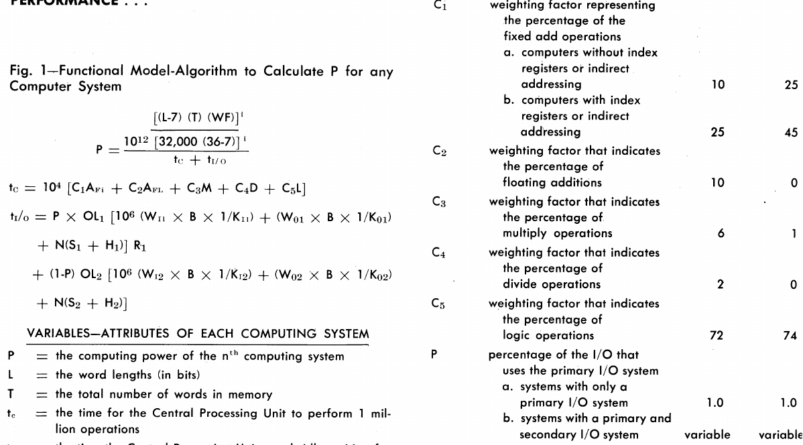
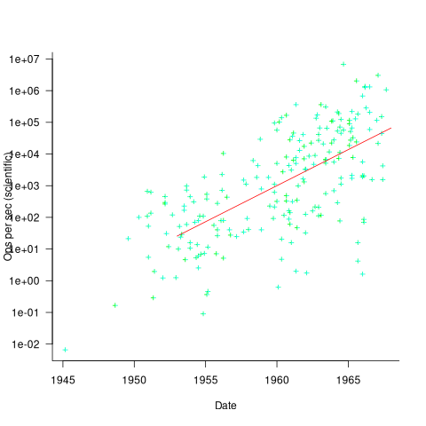
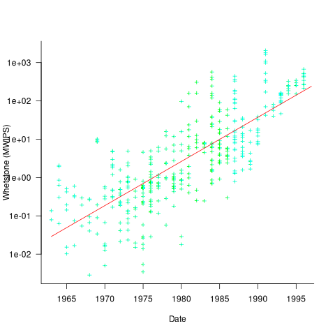
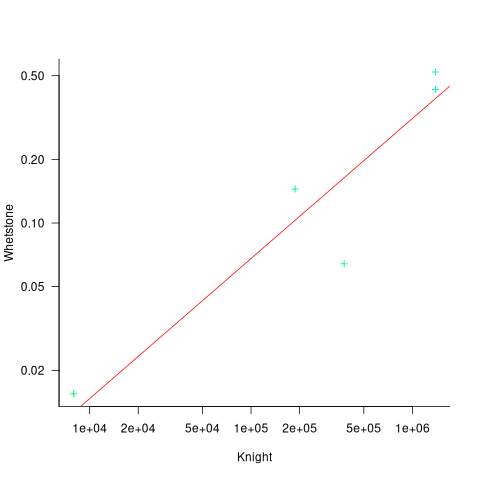
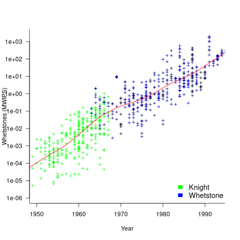

Computer performance 1953-1993
==============================
:author:    Derek M. Jones
:email:    derek@knosof.co.uk
:copyright: Somebody
:backend:   slidy
:max-width: 45em

About me
--------

{nbsp}

Compiler front ends/code generators

{nbsp}

Source code analysis

{nbsp}

Industrial research in software engineering

{nbsp}

Finding me

* Twitter: @evidenceSE
* Discord: https://discord.gg/uq6Vb92G
* Github: https://github.com/Derek-Jones
* Blog: https://shape-of-code.com
* derek@knosof.co.uk
* London based

Evidence-based Software Engineering
-----------------------------------

Evidence-based Software Engineering based on the publicly available data

pdf+code+all data freely available: http://knosof.co.uk/ESEUR

[caption="Figure ", label=ESEUR-Cover.jpg]
image::ESEUR-Cover.jpg[height=650,width=500,align="center"]

Overview
-------

{nbsp}

Performance estimation methods

{nbsp}

Performance datasets

{nbsp}

Aligning different methods/datasets

Estimating performance
----------------------

{nbsp}

What is measured

* single cpu
* minimal I/O

Produce a single number

{nbsp}

Formula based on machine characteristics

* cpu instruction timings
* Knight's PhD

{nbsp}

Time taken to execute program(s)

* Whetstone, Drystone, SPEC

Calculate using machine characteristics
---------------------------------------

{nbsp}

Kenneth Knight's 1963 PhD thesis + later work

* 1944-1963 (225 computers), 1963-1967 (63 computers) +
[small]'http//www.bitsavers.org/magazines/Datamation/196609.pdf' +
[small]'http://www.bitsavers.org/magazines/Datamation/196801.pdf'

Ein-Dor and Feldmesser

* modelled 209 cpus available for sale during 1981-1984 +
[small]'https://dl.acm.org/doi/10.1145/32232.32234'

{nbsp}

Number of operations per second, assuming

* representative sample (scientific and commercial)
* instruction execution time is constant
* one instruction per arithmetic/logical operation

Knight's formula
----------------

Scientific and Commercial

.Knight's formula and factor weightings
[caption="Figure ", label=png.jpg]

Instruction execution time
--------------------------

{nbsp}

Arithmetic instructions

* add
** small constant, halfword, word
* multiply
* divide
** not always available

{nbsp}

Load/Store

* load byte, halfword, and word
* data caching: 1968 IBM 360/85
* instruction caching: 1962

CPU implementation
------------------

{nbsp}

Bit-serial vs Parallel operation

{nbsp}

New designs for arithmetic operations

{nbsp}

Clock rate

* some instructions take very many cycles
** UNIVAC I: basic pulse rate 2.25 MHz, addition time 525 µs
* 50 kHz to hundreds kHz during 1950s to early 1960s

Knight's measurements
---------------------

Two sets of measurements

* 1944-1963 (225 computers), 1963-1967 (92 computers)
* 69% annual growth rate (fitted regression model)

.Knight's calculated operands per second for scientific applications
[caption="Figure ", label=png.jpg]

Grosch's law
------------

{nbsp}

Assertion made in the 1953 paper +
“High speed arithmetic: The digital computer as a research tool”

  It used to cost one cent to do a multiplication on a
  desk calculator; now it is more like four cents; but
  with these big machines we can do a million in an hour
  for \$400, and that means twenty-five multiplications
  for a cent! I believe that there is a fundamental rule,
  which I modestly call Grosch's law, giving added
  economy only as the square root of the increase in
  speed-that is, to do a calculation ten times as cheaply
  you must do it one hundred times as fast.

[small]'https://shape-of-code.com/2025/10/05/early-research-on-economies-of-scale-for-computer-systems/'

Executing programs (benchmarks)
-------------------------------

{nbsp}

Requires

* general availability of same high level language
* program(s) be representative of user code

{nbsp}

Advantages

* less effort invested to produce answer
* handles instruction variability and impact of cache

{nbsp}

Disadvantages

* program(s) may not be representative of user's code
* compiler tuned to characteristics of benchmark

Benchmark systems
-----------------

{nbsp}

KOPS (thousand operations per second) used during 1970s

* IBM job mix no 5
** 5% sorts, 22% compiles, 58% commercial apps, 15% technical apps
* Edward Lias critical of reliability of KOPS +
[small]'http://www.bitsavers.org/magazines/Datamation/198011.pdf'

{nbsp}

Whetstone

* written in 1972 plus later updates
* derived from statistics of Algol 60 usage with Whetstone compiler for KDF9 +
sample of 949 programs, average number of operations per program 152,000 +
[small]'https://www.researchgate.net/publication/265487549_ALGOL_60_Compilation_and_Assessment' +
[small]'https://shape-of-code.com/2023/10/22/design-of-the-whetstone-benchmark/'
* Algol 60, 85% published results used Fortran, also PL/1 and C

{nbsp}

Drystone (integer based, VAX 11/780), SPEC: 1989-present

Some statement timings
----------------------

40+ different statements run on 36 machines

 ATLAS   MU5     1906A   RRE Algol 68    B5500   Statement
 6.0     0.52    1.4     14.0            12.1    x:=1.0
 6.0     0.52    1.3     54.0            8.1     x:=1
 6.0     0.52    1.4     *12.6           11.6    x:=y
 9.0     0.62    2.0     23.0            18.8    x:=y + z
 12.0    0.82    3.2     39.0            50.0    x:=y × z
 18.0    2.02    7.2     71.0            32.5    x:=y/z
 9.0     0.52    1.0     8.0             8.1     k:=1
 18.0    0.52    0.9     121.0           25.0    k:=1.0
 12.0    0.62    2.5     13.0            18.8    k:=l + m
 15.0    1.07    4.9     75.0            35.0    k:=l × m
 48.0    1.66    6.7     45.0            34.6    k:=l ÷ m
 9.0     0.52    1.9     8.0             11.6    k:=l
 6.0     0.72    3.1     44.0            11.8    x:=l
 18.0    0.72    8.0     122.0           26.1    l:=y
 39.0    0.82    20.3    180.0           46.6    x:=y ^ 2
 48.0    1.12    23.0    213.0           85.0    x:=y ^ 3
 120.0   10.60   55.0    978.0           1760.0  x:=y ^ z
 21.0    0.72    1.8     22.0            24.0    e1[1]:=1
 27.0    1.37    1.9     54.0            42.8    e1[1, 1]:=1
 33.0    2.02    1.9     106.0           66.6    e1[1, 1, 1]:=1

Whetstone measurements
----------------------

Thanks to Roy Longbottom, 504 systems (429 Fortran) +
[small]'http://www.roylongbottom.org.uk/whetstone.htm'

* 33% annual growth rate (fitted regression model)

.Whetstone benchmark results with fitted regression line
[caption="Figure ", label=png.jpg]

Normalising two datasets
------------------------

{nbsp}

Same computer running both benchmarks

{nbsp}

First need to normalise computer names

* Computers Models Database +
[small]'http://www.epocalc.net/php/liste_models.php'

{nbsp}

Fit an equation to map Knight calculated values to Whetstones

Same computer different benchmarks
----------------------------------

Five results with Knight and Whetstone run on same computer

* fitted Deming regression model: latexmath:[$Whet=e^{-10.3}Knight^{0.66}$]

.Knight and Whetstone results for same computer, with fitted Deming regression line
[caption="Figure ", label=png.jpg]

Relative computer performance 1953-1993
---------------------------------------

Average relative performance increase

* Knight period: ~1,000
* Whetstone period: ~3,000
* clock rate increase 1953-1980-1993: 10s of kHz to 5-10 MHz to 50-100 MHz
* cpu design improvements

.Mapped Knight data (green), Whetstones (blue), and loess regression (red)
[caption="Figure ", label=png.jpg]

Where next?
-----------

{nbsp}

Remove memory size from calculated values

* requires data on likely memory capacity of systems

{nbsp}

Run Whetstone benchmark on more early systems

Analyse your data?
------------------

{nbsp}

* Do you have any human related software engineering data? +
Jira repo, project schedules, etc

* Free analysis of your data +
Provided I can publish an anonymized version of the data +
Renzo's Pomodoro data
[small]'https://shape-of-code.com/2019/12/15/the-renzo-pomodoro-dataset/'

{nbsp}

* derek@knosof.co.uk
* blog: https://shape-of-code.com
* Twitter: @evidenceSE

