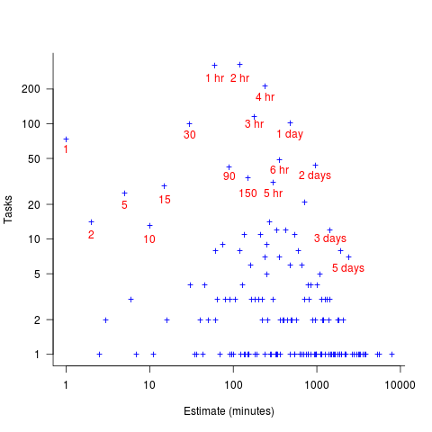
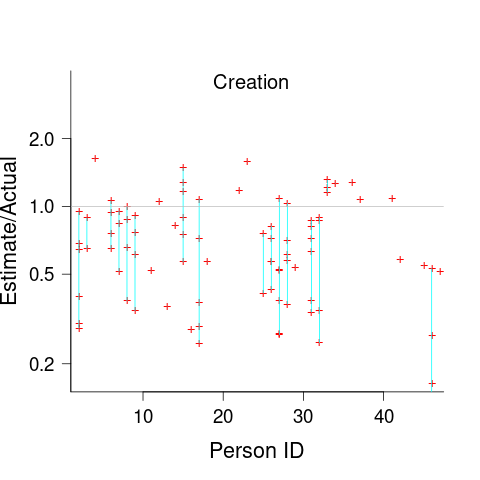
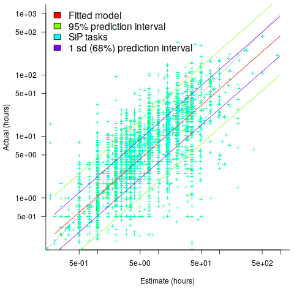
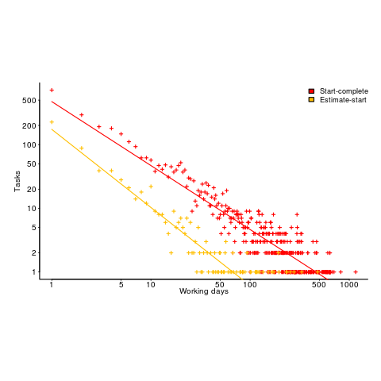

Estimating software tasks: Human behaviour + Data
=================================================
:author:    Derek M. Jones
:email:    derek@knosof.co.uk
:copyright: Somebody
:backend:   slidy
:max-width: 45em

Introduction
------------

{nbsp}

Pre-2019 public effort estimation data

* _Software effort estimation is mostly fake research_ +
[small]'https://shape-of-code.com/2021/01/17/software-effort-estimation-is-mostly-fake-research/'
* mostly bids for work, a few internal estimates, e.g., Hatton
* datasets mostly less than 100 rows, a few have several hundred rows

{nbsp}

Post-2019 public effort estimation data

* Data discussed in this talk
* task estimated at few hours/days
* datasets containing thousands of rows

Post-2019 data
--------------

{nbsp}

"A conversation around the analysis of the SiP effort estimation dataset"

* 10,100 unique tasks
* 8,252 completed unique tasks
* 22 developers
* 20 internal projects

{nbsp}

"The CESAW dataset: a conversation"

* 61,817 tasks
* 45 external projects

Blog

* http://shape-of-code.coding-guidelines.com

Estimator incentives
--------------------

{nbsp}

Bidding for work

* competing against others
* bid low to win the contract, recoup by charging for unplanned work
* "I believe planners and consultants in general deliberately underestimate
project costs because their political bosses or clients want the projects.
Sometimes, to tell the truth is to risk your job or your contracts or the next
contract..." +
Bent Flyvbjerg
"How planners deal with uncomfortable knowledge:
The dubious ethics of the American Planning Association"

{nbsp}

Asked, by manager, to do the work

* not usually a competitive environment, internal project
* if estimate not accepted, other work available
* impress management, e.g., estimate high, deliver under budget

Recurring behaviors
-------------------

{nbsp}

Use of round numbers

{nbsp}

Consistent over/under estimation

{nbsp}

Accuracy factors

{nbsp}

Waiting times

Round numbers
-------------

* communicate an approximate value and level of accuracy
* divisible by two or five, powers of ten
* estimate in larger units and back calculate

.Number of tasks estimated to take a given time; total 1,945 tasks
[caption="Figure ", label=png.jpg]

Developer risk preference
-------------------------

* consistent under/over estimation

.Individual relative estimate/actual ratio for 7 creation tasks (CESAW project 615)
[caption="Figure ", label=effort-person-insp.png]

Accuracy intervals
------------------

* 30% accurate
* 66% within a factor of two
* 95% within a factor of four

.Estimate/Actual 9k+ software tasks, with fitted regression line+confidence bounds
[caption="Figure ", label=est-over-under-factor.png]

Waiting time
------------

{nbsp}

Waiting time for tasks in a priority queue is a power law

.Power law fitted to waiting times (exponent -1)
[caption="Figure ", label=Elapsed-day-task.png]

Book
----

Evidence-based Software Engineering based on the publicly available data
pdf+code+all data freely available
'http://knosof.co.uk/ESEUR'

[caption="Figure ", label=ESEUR-Cover.jpg]
image::ESEUR-Cover.jpg[height=350,width=500,align="center"]

Analyse your data?
------------------

{nbsp}

* Do you have any human related software engineering data? +
Jira repo, project schedules, etc

* Free analysis of your data +
Provided I can publish an anonymized version of the data +
Renzo's Pomodoro data
[small]'https://shape-of-code.com/2019/12/15/the-renzo-pomodoro-dataset/'

{nbsp}

* derek@knosof.co.uk
* blog: https://shape-of-code.com
* Twitter: @evidenceSE

