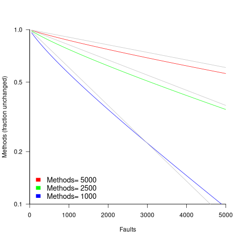

Solving maths problems with LLMs
================================
:author:    Derek M. Jones
:email:    derek@knosof.co.uk
:copyright: Somebody
:backend:   slidy
:max-width: 45em

Evidence-based Software Engineering
-----------------------------------

Evidence-based Software Engineering based on the publicly available data +
pdf+code+all data freely available http://knosof.co.uk/ESEUR

Shape of code https://shape-of-code.com

[caption="Figure ", label=ESEUR-Cover.jpg]

What are LLMs good for?
-----------------------

{nbsp}

Search engine for useful theorems and models

{nbsp}

Great at finding 'close' solutions

{nbsp}

Hallucinations

* 1+1=1
* drop variables
* suggestions not applicable

Which LLM?
----------

{nbsp}

LLMs I use for maths problems

* kimi
* chatGPT5 Thinking
* deepseek
* grok

Issues with the question
------------------------

{nbsp}

Ambiguities in the specification

1. The phrase "the probability of going via state j is 1/j" is a bit ambiguous. +
To interpret it correctly, let's consider that at any given state i, the ball +
can move to any state j where j<i, and the ...

2. Another interpretation is that from state i, the ball moves to any state j ...

3. Given the confusion, let's consider that the process is a Markov chain where ...

4. Perhaps a better interpretation is that the process is a sequence where from ...

* [small]'Kimi conversation: https://www.kimi.com/share/d3mg0pblmiu3upjf9qbg'

{nbsp}

No analytic solution

{nbsp}

Maybe an algorithmic solution

Learn new maths
---------------

{nbsp}

Polylogarithms: latexmath:[$Li_s(z)=\sum_{k=1}^\infty\frac{z^k}{k^s}$]

Fokker-Planck equation

{nbsp}

.Have fun
[caption="Figure ", label=surgeon+suit-having-fun.jpg]

Is the answer correct?
----------------------

Check the derivation

Do other LLMs give the same answer?

latexmath:[$E_m=\frac{M}{\zeta(b)}Li_b(e^{-\frac{F}{M}\frac{\zeta(b)}{\zeta(b-1)}}) \approx Me^{-\frac{F}{2M}}$]

[small]'https://shape-of-code.com/2025/09/07/percentage-of-methods-containing-no-reported-faults/'

Plot the equation

.Fraction of fault free methods after given number of fault reports
[caption="Figure ", label=meth-fault-uniform.png]

Analyse your data?
------------------

{nbsp}

* Do you have any human related software engineering data? +
Jira repo, project schedules, etc

{nbsp}

* Free analysis of your data +
Provided I can publish an anonymized version of the data +

{nbsp}

* derek@knosof.co.uk
* Twitter: @evidenceSE
* https://discord.gg/EQm5Hucf

