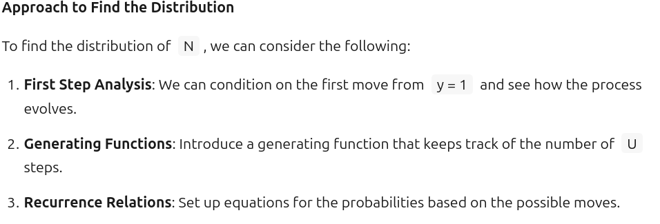
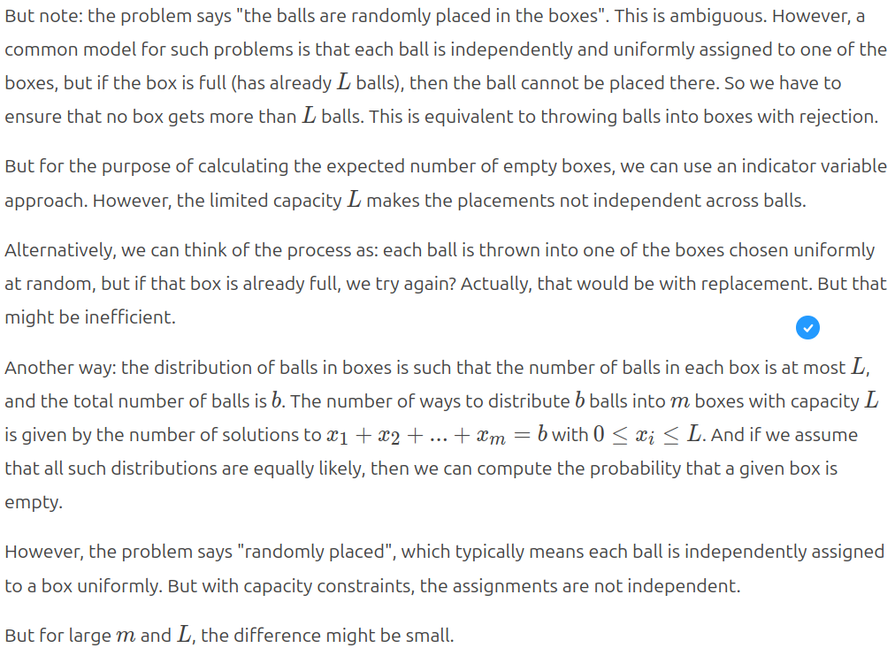
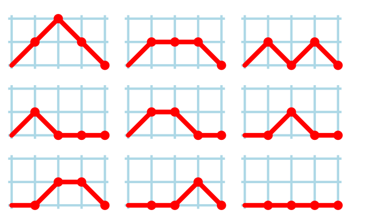

Modelling software process behaviours with LLM assistants
=========================================================
:author:    Derek M. Jones
:email:    derek@knosof.co.uk
:copyright: Somebody
:backend:   slidy
:max-width: 45em

About me
--------

{nbsp}

Compiler front ends/code generators

{nbsp}

Source code analysis

{nbsp}

Industrial research in software engineering

{nbsp}

Finding me

* Twitter: @evidenceSE
* Discord: https://discord.gg/uq6Vb92G
* Github: https://github.com/Derek-Jones
* Blog: https://shape-of-code.com
* derek@knosof.co.uk
* London based

Evidence-based Software Engineering
-----------------------------------

Evidence-based Software Engineering based on the publicly available data

pdf+code+all data freely available: http://knosof.co.uk/ESEUR

[caption="Figure ", label=ESEUR-Cover.jpg]
image::ESEUR-Cover.jpg[height=650,width=500,align="center"]

Overview
--------

{nbsp}

Mapping a software question to mathematical question

{nbsp}

Fully specifying the question

{nbsp}

Chain-of-Thought (CoT)

{nbsp}

Verifying the answers

LLMs are getting better
-----------------------

{nbsp}

LLMs I use for maths problems

* First choice: Deepseek, Kimi.  Recently GLM5.1
* Mostly ignored, until recently: ChatGPT, Grok

{nbsp}

Output sometimes just stops

{nbsp}

Algebra mistakes (just like people)

* 1+1=1
* drop variables

{nbsp}

Sometimes persist in going down the wrong rabbit hole (just like people)

Asking the right question
-------------------------

{nbsp}

Asking a software question produces

* opinions from blog posts
* summaries of published research

{nbsp}

Obtaining a mathematical answer requires asking a mathematical question

{nbsp}

Software question has to be framed in mathematical terms

* creativity
* lateral thinking
* prior experience is very helpful

{nbsp}

Iterative process

* prompt tuning

Chain-of-Thought
----------------

{nbsp}

The series of intermediate reasoning steps leading to the answer. +
Appears as human-like reasoning.

{nbsp}

Deepseek, Kimi, GLM5.1 produce CoT +
ChatGPT, Grok recently started producing CoT

{nbsp}

[caption="Figure ", label=kimi-approach_CoT.png]

Chain-of-Thought output is essential
------------------------------------

{nbsp}

Does the LLM interpret the question correctly?

{nbsp}

Check (human and LLM) assumptions are reasonable

{nbsp}

Verify the answer by stepping through the derivation

{nbsp}

Suggest different approaches to modelling the problem

Kimi CoT interpretation of question
-----------------------------------

[caption="Figure ", label=Deepseek-quest-interp-CoT.png]

You will have to learn new maths
--------------------------------

{nbsp}

Polylogarithms: latexmath:[$Li_s(z)=\sum_{k=1}^\infty\frac{z^k}{k^s}$]

{nbsp}

Wikipedia, Grokipedia

{nbsp}

Research papers, blogs, books

{nbsp}

Ask another LLM

Example 1
---------

{nbsp}

What is the expected number of lines of code, $L$, in the next release, $r$, of a program

{nbsp}

Model as a recurrence relation

latexmath:[$L_{r+1}=a*L_r+b$]

----
Solve the following recurrence relation
\$L_{r+1}=a*L_r+b\$ where \$a\$ and \$b\$ are constants
----

{nbsp}

Update to include number of developers, $D$, in model

latexmath:[$L_{r+1}=a*L_r+b*D_r$] +
latexmath:[$D_r=c*D_{r-1}+d*L_{r-1}$]

----
Solve the following two recurrence relations for \$L\$
\$L_{r+1}=a*L_r+b*D_r\$ and
\$D_r=c*D_\{r-1}+d*L_{r-1}\$
\$a\$, \$b\$, \$c\$ and \$d\$ are constants
----

Example 2
---------

{nbsp}

How many distinct statement sequences can be written using

* $N$ if-statements and
* $S-N$ assignment statements

{nbsp}

----
{
s1;
if (c1) {
   s2;
   s3;
   }
}
----
 
Mathematical model of example 2
-------------------------------

{nbsp}

Treat each line of code as a step on a 2-D lattice

* an assignment statement occupying a line is one step down the page
* an if-statement occupies both a line and indented to the right
* end of if-statement indents to the left

[caption="Figure ", label=750px-Motzkin4.png]

Mathematical question
---------------------

{nbsp}

----
How many valid Dyck paths are there of length $S$,
where the path consists of:
Exactly $N$ upward steps (1,1).
Exactly $N$ downward steps (1,−1).
The remaining steps are $S-2*N$ horizontal steps (1,0).
These paths must never dip below the x-axis,
and they must return to the x-axis at the end.
----

{nbsp}

Answer, after a few iterations of prompt tuning

latexmath:[$\frac{S!}{{(N+1)!N!}(S-2*N)!}$]

More complicated question
-------------------------

{nbsp}

A particle on a two-dimensional lattice can move as follows:
 
* from ($x,y$) to ($x+1, y$) with probability latexmath:[$R$],
* from ($x,y$) to ($x+1, y+1$) with probability latexmath:[$U$],
* from ($x,y$) to ($x+1, y-1$) with probability latexmath:[$D$],

where latexmath:[$U \le D$] and latexmath:[$R+U+D = 1$]

Starting at the point (1,1) what is the distribution of the +
number of steps needed to reach the first point where latexmath:[$y=0$]

Example 3
---------

{nbsp}

----
What is the expected fraction of a program's functions/methods
that have not been modified, after fixing all reported faults.
----

Mathematical model of example 3
-------------------------------

{nbsp}

----
$m$ identical boxes can each hold a maximum of $L$ balls,
and there are $b$ identical balls,
balls are uniformly at randomly placed in non-full boxes,
where $L < m$ and $m*L > b$ and 
$b$ can have a similar size as $m$
What is the expected number of boxes that do not contain a ball
----

“uniformly at randomly” is the mathematical way of saying +
“the behavior is random with all possibilities being equally likely”

Add some real-world behavior
----------------------------

{nbsp}

Functions have different sizes, in LOC, +
size distribution is a power law

{nbsp}

----
There are $m$ boxes, $B_n$, $1 <= n <= m$ where the
number of boxes that can hold $L$ balls, $1 <= L <= T$,
is proportional to $L^{-b}$,
and there are $F$ identical balls,
balls are uniformly at randomly placed in non-full boxes,
where the number of balls $F$ is much less than
the available places to hold them.
What is the expected number of boxes that do not contain a ball
----

Add more real-world behavior
----------------------------

{nbsp}

Some program functionality is used more often than other +
frequently used functions are more likely to involve a fault report.

Model using preferential attachment

{nbsp}

----
There are $m$ boxes, $B_n$, $1 <= n <= m$
where the number of boxes that can hold $L$ balls, $1 <= L <= T$,
is proportional to $L^{-b}$, and there are $F$ identical balls,
balls are randomly placed in non-full boxes
with probability proportional to $L*(1+O)$
where $O$ is the number of balls currently in the box,
the number of balls $F$ is much less than the available places
to hold them, and $2 < b$.
What is the expected number of boxes that do not contain a ball
----

Is the answer correct?
----------------------

{nbsp}

Do other LLMs give the same answer?

latexmath:[$X=\sum_{k=1}^N ...$] +
latexmath:[$X=\sum_{k=0}^{N-1} ...$]

{nbsp}

Check the derivation: needs CoT

{nbsp}

Plot the equation:
latexmath:[$E_m=\frac{M}{\zeta(b)}Li_b(e^{-\frac{F}{M}\frac{\zeta(b)}{\zeta(b-1)}}) \approx Me^{-\frac{F}{2M}}$] +

.Fraction of fault free methods after given number of fault reports
[caption="Figure ", label=meth-fault-uniform.png]
image::meth-fault-uniform.png[height=600,width=600,align="center"]

More detailed discussion
------------------------

{nbsp}

Articles involving an LLM assistant solving maths problems

{nbsp}

[small]'https://shape-of-code.com/2026/04/26/working-with-an-llm-maths-assistant-to-model-software-processes/' +
[small]'https://shape-of-code.com/2026/04/19/predicting-reports-of-new-faults-by-counting-past-reports/' +
[small]'https://shape-of-code.com/2026/01/18/formal-methods-and-llm-generated-mathematical-proofs/' +
[small]'https://shape-of-code.com/2026/01/04/modelling-time-to-next-reported-fault/' +
[small]'https://shape-of-code.com/2025/10/19/finding-links-between-gcc-source-code-and-the-c-standard/' +
[small]'https://shape-of-code.com/2025/09/07/percentage-of-methods-containing-no-reported-faults/' +
[small]'https://shape-of-code.com/2024/09/29/modeling-program-loc-growth-with-recurrence-equations/' +
[small]'https://shape-of-code.com/2024/09/15/number-of-statement-sequences-possible-using-n-if-statements/'

Analyse your data?
------------------

{nbsp}

* Do you have any human related software engineering data? +
Jira repo, project schedules, etc

{nbsp}

* Free analysis of your data +
Provided I can publish an anonymized version of the data +

{nbsp}

* derek@knosof.co.uk
* Twitter: @evidenceSE
* https://discord.gg/EQm5Hucf

