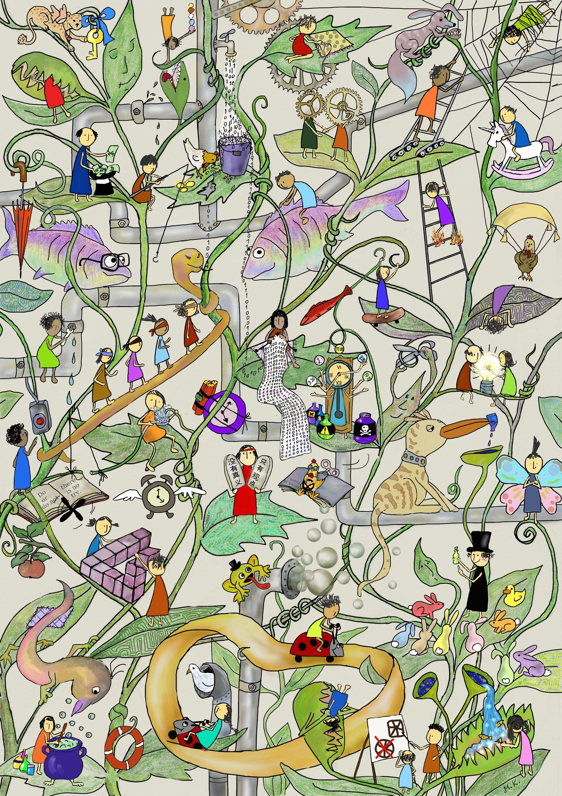

Benchmarking C++ compilers
==========================
:author:    Derek M. Jones
:email:    derek@knosof.co.uk
:copyright: Somebody
:backend:   slidy
:max-width: 45em

About me
--------

{nbsp}

Compiler front ends/code generators

{nbsp}

Source code analysis

{nbsp}

Industrial research in software engineering

{nbsp}

Finding me

* Twitter: @evidenceSE
* Discord: https://discord.gg/YV4RyKPr
* Github: https://github.com/Derek-Jones
* Blog: https://shape-of-code.com
* derek@knosof.co.uk
* London based

Book
----

Evidence-based Software Engineering based on the publicly available data

pdf+code+all data freely available +
http://knosof.co.uk/ESEUR

[caption="Figure ", label=ESEUR-Cover.jpg]

Overview
--------

{nbsp}

Collecting data

{nbsp}

Analyzing data

{nbsp}

Examples

Collecting data
---------------

{nbsp}

Representative sample

* convenience sampling

{nbsp}

System used for running benchmark

* control of all running processes

{nbsp}

Design of experiments

{nbsp}

The more measurements the better

Representative sample
---------------------

{nbsp}

Typical code

* who is the user of the results?

{nbsp}

Use a large body of code

* GitHub is a convenient population

{nbsp}

SPEC benchmarks

* [small]'www.spec.org/benchmarks.html'
* now includes EEMBC

Design of experiments
---------------------

{nbsp}

Interacting variables

* Latin squares
* Full factorial and fractional factorial designs
* Plackett-Burman Designs

{nbsp}

Other random effects

* other processes consuming system resources
* effects of caching

Fractional factorial design
---------------------------

{nbsp}

Full factorial design with five variables involves latexmath:[$2^5=32$] combinations

Fractional factorial latexmath:[$2^{5-2}$] design

{nbsp}

----
   Run   A   B   C   D   E
    1    -   -   -   +   -
    2    +   -   -   +   +
    3    -   +   -   -   +
    4    +   +   -   -   -
    5    -   -   +   -   -
    6    +   -   +   -   -
    7    -   +   +   +   -
    8    +   +   +   +   +
----

Modeling performance
--------------------

{nbsp}

Typically uses rudimentary statistics

* mean/median value
* standard deviation
* chart porn

{nbsp}

Regression modeling

* fit a formula specifying relationship between variables
* latexmath:[$compile_{time}=k+header_x+compiler_y+language_z$]
* interaction between components

Visual studio C++ compile times
-------------------------------

{nbsp}

virtuallyrandom blog

* C++ Compilation: Lies, Damned Lies, and Statistics +
[small]'virtuallyrandom.com/c-compilation-lies-damned-lies-and-statistics/'

The benchmark
-------------

{nbsp}

[source,cpp]
----
#include <assert.h>
int testFunction() { return 0; }
----

C++ standard

* C&#43;&#43;98, C&#43;&#43;03, C&#43;&#43;11, C&#43;&#43;14

Compilers

* VS15, VS17, clang

#include

* 99 headers

{nbsp}

Every combination run 128  times

* 10 to 24 hours elapsed time

Analysis of the data
--------------------

{nbsp}

Modeling visual studio C++ compile times +
[small]'shape-of-code.com/2019/01/29/modeling-visual-studio-c-compile-times/'

{nbsp}

Additive model

* latexmath:[$compile_{time}=k+header_x+compiler_y+language_z$]
* latexmath:[$compile_{time}=k+header_x+compiler_y+language_z+compiler_y\times language_z$]

{nbsp}

Multiplicative model

* latexmath:[$compile_{time}=c\times header_x\times compiler_y\times language_z$]

Fitted additive model
---------------------

Coefficients of fitted regression model

----
             (Intercept)                  headerany 
               1.000000000                0.051100398 
               headerarray             headerassert.h 
               0.522336397               -0.654056185 
...
            headerwctype.h            headerwindows.h 
              -0.648095154                1.304270250 
              compilerVS15               compilerVS17 
              -0.185795534               -0.114590143 
             languagec++11              languagec++14 
               0.032930014                0.156363433 
             languagec++17              languagec++20 
               0.192301727                0.184274629 
             languagec++98 compilerVS15:languagec++11 
               0.001149643               -0.058735591 
compilerVS17:languagec++11 compilerVS15:languagec++14 
              -0.038582437               -0.183708714 
compilerVS17:languagec++14 compilerVS15:languagec++17 
              -0.164031495                         NA 
compilerVS17:languagec++17 compilerVS15:languagec++20 
              -0.181591418                         NA 
compilerVS17:languagec++20 compilerVS15:languagec++98 
              -0.193587045                0.062414667 
compilerVS17:languagec++98 
               0.014558295
----

Example additive calculation
----------------------------

{nbsp}

The (normalised) time to compile +
'wchar.h' +
using 'VS15' +
with 'C++11' is

1-0.514807638-0.183862162+0.033951731-0.059720131 == 0.2755618

Fitted multiplicative model
---------------------------

----
               (Intercept)                  headerany 
              9.724619e+08               1.051756e+00 
...
            headerwctype.h            headerwindows.h 
              3.138361e-01               2.288970e+00 
              compilerVS15               compilerVS17 
              7.286951e-01               7.772886e-01 
             languagec++11              languagec++14 
              1.011743e+00               1.049049e+00 
             languagec++17              languagec++20 
              1.067557e+00               1.056677e+00 
             languagec++98 compilerVS15:languagec++11 
              1.003249e+00               9.735327e-01 
compilerVS17:languagec++11 compilerVS15:languagec++14 
              9.880285e-01               9.351416e-01 
compilerVS17:languagec++14 compilerVS15:languagec++17 
              9.501834e-01                         NA 
compilerVS17:languagec++17 compilerVS15:languagec++20 
              9.480678e-01                         NA 
compilerVS17:languagec++20 compilerVS15:languagec++98 
              9.402461e-01               1.058305e+00 
compilerVS17:languagec++98 
              1.001267e+00
----

Example multiplicative calculation
----------------------------------

{nbsp}

The cpu cycles to compile +
'wchar.h' +
using 'VS15' +
with 'C++11' is

latexmath:[$(9.724619\times 10^8)\times0.3138361\times0.7286951\times1.011743\times0.9735327$]

C++ vs Rust compile times
-------------------------

{nbsp}

Is coding in Rust as bad as in C++? +
[small]'quick-lint-js.com/blog/cpp-vs-rust-build-times/'

strager [small]'strager.net/'

{nbsp}

A comparison of C++ and Rust compiler performance +
[small]'shape-of-code.com/2023/01/29/a-comparison-of-c-and-rust-compiler-performance/'

Benchmark sample
----------------

{nbsp}

C++ program containing 9.3k LOC, plus 7.3K LOC of tests

{nbsp}

Convert to Rust (9.5K LOC, plus 7.6K LOC of tests)

{nbsp}

Largest file copy-pasting 8, 16, and 32 times, to create three every larger versions.

{nbsp}

Every combination run 10 times 

Benchmark issues
----------------

{nbsp}

Small sample size

[caption="Figure ", label=C++_Rust-bench-timeline.png]

Regression model results
------------------------

{nbsp}

Regression model

* latexmath:[$compile_{time} \approx e^{copies*(0.028+0.035L)-0.084L}$]
* C++, L=0 
* Rust, L=1

----
                     Copies
             1      8      16      32
   C++     1.03   1.25    1.66    2.45
   Rust    0.98   1.52    2.86    6.90
----

Confidence intervals
--------------------

{nbsp}

Regression model with confidence intervals

* latexmath:[$compile_{time} \approx e^{copies*(0.028\pm0.001+(0.035\pm0.002)L)-(0.084\pm0.03)L}$]
* C++, L=0 
* Rust, L=1

----
                            Copies
              1           8           16          32
   C++    1.03+-0.0   1.25+-0.01   1.66+-0.03  2.45+-0.08
   Rust   0.98+-0.0   1.52+-0.08   2.86+-0.2   6.90+-0.8
----

Analyse your data?
------------------

{nbsp}

* Do you have any human related software engineering data? +
Jira repo, project schedules, etc

{nbsp}

* Free analysis of your data +
Provided I can publish an anonymized version of the data +
Renzo's Pomodoro data
[small]'shape-of-code.com/2019/12/15/the-renzo-pomodoro-dataset/'

{nbsp}

* derek@knosof.co.uk
* Twitter: @evidenceSE
* https://discord.gg/YV4RyKPr

