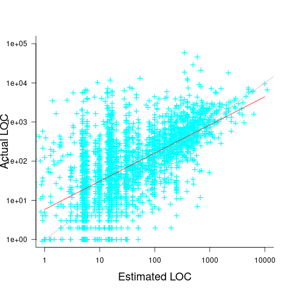
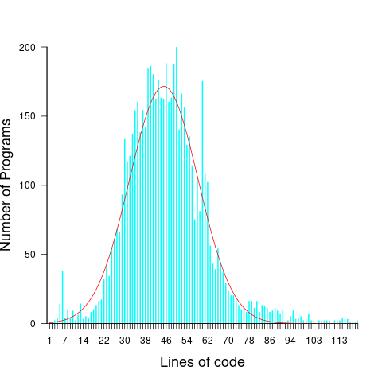
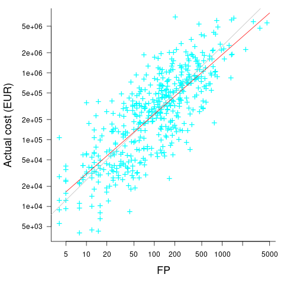
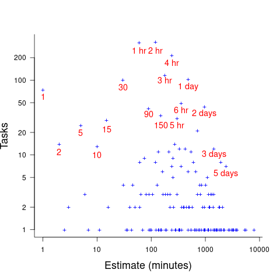
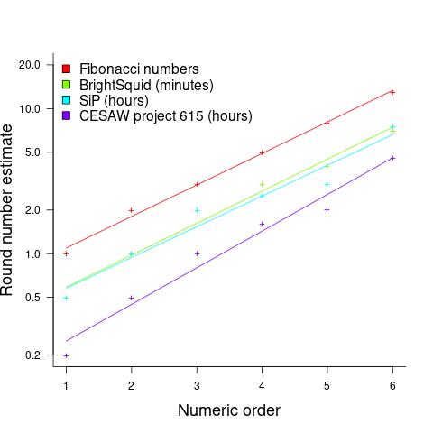
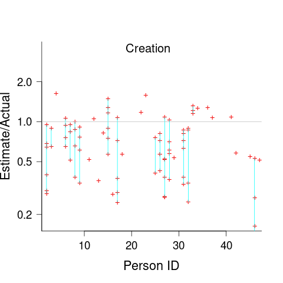
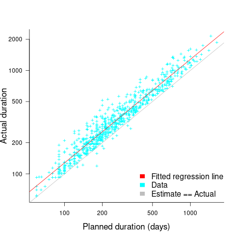
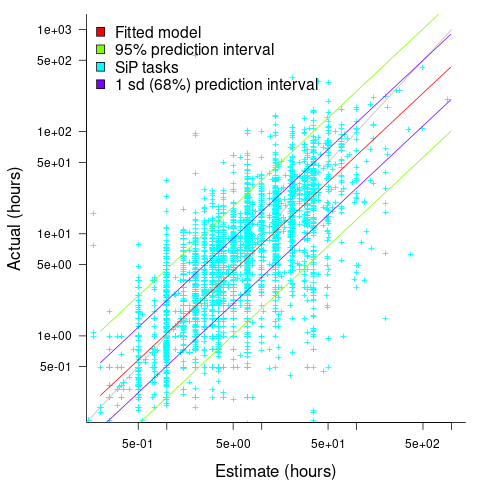
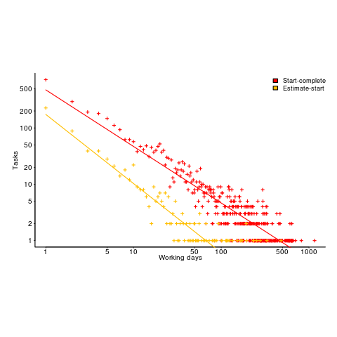

Estimating software tasks: What do we know?
===========================================
:author:    Derek M. Jones
:email:    derek@knosof.co.uk
:copyright: Somebody
:backend:   slidy
:max-width: 45em

About me
--------

{nbsp}

Knowledge Software 1983

{nbsp}

Compiler front ends/code generators

{nbsp}

Source code analysis

{nbsp}

Industrial research

{nbsp}

Finding me

* Twitter: @evidenceSE
* https://discord.gg/EU3rutXa
* derek@knosof.co.uk
* London based

Book
----

{nbsp}

Evidence-based Software Engineering based on the publicly available data
pdf+code+all data freely available +
http://knosof.co.uk/ESEUR

[caption="Figure ", label=ESEUR-Cover.jpg]

Slides+data
-----------

{nbsp}

Github

* https://github.com/Derek-Jones

{nbsp}

book: Evidence-Based Software Engineering

* http://www.knosof.co.uk/ESEUR

{nbsp}

blog: Shape of code

* https://shape-of-code.com

Overview
--------

{nbsp}

Estimation environment

* Quoting for external work
* Internal planning

{nbsp}

History of estimating software

* Models
* Data public/confidential
* Accuracy

{nbsp}

Modern, post-2019 perspective

Estimator incentives
--------------------

{nbsp}

Bidding for work

* Competing against others
* Bid low to win the contract, recoup by charging for unplanned work
* "I believe planners and consultants in general deliberately underestimate
project costs because their political bosses or clients want the projects.
Sometimes, to tell the truth is to risk your job or your contracts or the next
contract..." +
Bent Flyvbjerg
"How planners deal with uncomfortable knowledge:
The dubious ethics of the American Planning Association"

{nbsp}

Asked by manager

* Not usually a competitive environment, internal project
* If estimate not accepted, other work available
* Impress management, e.g., estimate high, deliver under budget

Cost of estimating
------------------

{nbsp}

What is the ROI for investing in estimation accuracy?

{nbsp}

Function points

* 1 FP "costs" £1,000-£1,500
* Average estimation rate: 200-750 NESMA FP/day +
[small]'Agile counting process of software product maintenance size: A statistical analysis by Calazans, Martins, Masson, Teixeira'

{nbsp}

No data (yet)

Environment, models and data
----------------------------

{nbsp}

Pre-2019

* Mostly bids for external work, a few internal estimates, e.g., Hatton
* Almost all datasets less than 100 rows, a few have several hundred rows
* Task estimated to take many days/weeks
* Models built to make predictions
* Early researchers created theories
* Most researchers interested in publishing papers +
[small]'https://shape-of-code.com/2021/01/17/software-effort-estimation-is-mostly-fake-research/'

{nbsp}

Post-2019

* Mostly bids for internal work, a few external estimates
* Datasets containing thousands of rows
* Task estimated to take a few hours/days
* Models built to understand behaviors and processes
* Most researchers interested in publishing papers +

History of estimating software
------------------------------

{nbsp}

Date from late 1970s

{nbsp}

What to estimate

* Time/cost
* Staffing

{nbsp}

Theory

* Existing models - manufacturing
* Input parameters: Lines of Code (LOC), Application domain

{nbsp}

Military/NASA projects

* Large projects
* Many companies involved
* High integrity

Historical models
-----------------

{nbsp}

COCOMO

* Academic
* Widely cited
* Overfits 63 rows of data +
[small]'Software cost estimating models: A calibration, validation, and comparison, by Ourada' +
[small]'https://shape-of-code.com/2016/05/19/cocomo-how-not-to-fit-a-model-to-data/'
* COCOMO II overfits 161 rows

{nbsp}

Putnam

* Industry training/consultancy
* Differential equation - Rayleigh
* Large projects - people are cogs in the delivery process
* Data+fitted curve +
[small]'https://github.com/Derek-Jones/ESEUR-code-data/blob/master/projects/basili1981.R'

{nbsp}

Others

* System dynamics +
[small]'Software Project Dynamics: An Integrated Approach, by Abdel-Hamid and Madnick' +
[small]'Designing an Optimal Software Intensive System Acquisition: A Game Theoretic Approach, by Buettner' 
* Comparison of 12 estimation model +
[small]'https://github.com/Derek-Jones/ESEUR-code-data/blob/master/projects/mohanty1981.R'

Estimation datasets
-------------------

{nbsp}

Public datasets +
[small]'Public datasets Review of Existing Datasets Used for Software Effort Estimation, by Rahman, Gonçalves, Sarwar'

* Albrecht 24 rows, 1980
* COCOMO 63 rows, 1981
* NASA 18 rows, 1981
* Desharnais 81 rows, 1989
* China 499 rows, 2010
* Data & Analysis Center for Software (DACS): currently lost +
[small]'https://shape-of-code.com/2017/02/19/dacs-software-life-cycle-empiricalexperience-database/'

{nbsp}

Rome Air Development Center

* Primary research lab of the US Air Force +
[small]'https://shape-of-code.com/2016/05/23/the-fall-of-rome-and-the-ascendancy-of-ego-and-bluster/'
* Officer Masters' thesis

{nbsp}

Confidential datasets

* Company data obtained by researchers who publish a paper
* US DoD - Defense Technical Information Center +
[small]'https://discover.dtic.mil/'
* US DoD - Cost Assessment Data Enterprise (CADE) +
[small]'https://cade.osd.mil/' +
[small]'https://cade.osd.mil/policy/srdr'
* NASA
* ISBSG - International Software Benchmarking Standards Group non-profit

COCOMO data
-----------

{nbsp}

Data used in nearly every published estimation study

[caption="Figure ", label=COCOMO-book-photo.jpg]
image::COCOMO-book-photo.jpg[height=750,width=1200,align="center"]

COCOMO
------

{nbsp}

Accuracy

* Various studies found poor accuracy +
[small]'Software cost estimating models: A calibration, validation, and comparison, by Ourada' +
[small]'https://shape-of-code.com/2016/05/19/cocomo-how-not-to-fit-a-model-to-data/'

{nbsp}

COCOMO II

* 161 rows (98 more rows, not public)
* More parameters added to the fitted model
* No public evaluation (papers by Boehm's group) +
[small]'https://digitallibrary.usc.edu/archive/Calibrating-COCOMO--II-for-functional-size-metrics-2A3BF1WZ00HH.html'

Estimating LOC
--------------

[small]'https://shape-of-code.com/2021/04/18/another-nail-for-the-coffin-of-past-effort-estimation-research/'

[caption="Figure ", label=LOC-est-act.png]

LOC for same functionality varies across developers  +
[small]'https://shape-of-code.com/2021/05/09/estimate-variability-for-the-same-task/'

[caption="Figure ", label=3n+1_progs.png]

Research summary
----------------

{nbsp}

Fake research

* 100+ papers fitting models to the same small datasets +
[small]'https://shape-of-code.com/2021/01/17/software-effort-estimation-is-mostly-fake-research/'

{nbsp}

Who does real software estimation research?

* Business schools +
[small]'https://shape-of-code.com/2018/09/11/business-school-research-in-software-engineering-is-some-of-the-best/'
* Magne Jørgensen +
[small]'https://www.simula.no/people/magnej'
* Runs experiments

{nbsp}

Details + references

* Evidence-based software engineering: section 5.3 +
[small]'http://knosof.co.uk/ESEUR'

Agile projects
--------------

{nbsp}

Break work down into small tasks

{nbsp}

Backlog of tasks

{nbsp}

Scrum/XP/Kanban/Lean

{nbsp}

Unit of measurement

* No estimates
* Function points
* Story points
* Time

No estimates
------------

{nbsp}

Estimates are

* Inaccurate
* Misused
* Very unpopular with developers
* Therefore, don't do them

Demand for developers outstrips supply

[caption="Figure ", label=surgeon+suit-having-fun.jpg]

Function points
---------------

{nbsp}

Amount of business functionality

* Introduced in 1979 by Albrecht
* Highly correlated with lines of code

{nbsp}

ISO Standards

* FiSMA, IFPUG, Mark-II, Nesma, COSMIC, OMG
* Accredited FP counter, trained to produce consistent results

{nbsp}

Performance

* Counts appear to be consistent
* Accuracy similar to time estimates +
[small]'https://shape-of-code.com/2023/08/06/accuracy-of-function-point-estimates/'

.Estimated FPs vs. actual cost from two companies (149 and 492 projects)
[caption="Figure ", label=FP-cost-combined.png]

Story points
------------

{nbsp}

Not supposed to be time

* Psychologically "safe"?
* Monopoly money

{nbsp}

People pick a number

* Claim: individuals consistent over time
* Claim: teams converge to consistency
* Data on actual times provides a mapping (what to, if it's not time?)
* Fibonacci numbers: 1, 2, 3, 5, 8, 13, 20 +
[small]'https://shape-of-code.com/2024/02/11/some-information-on-story-point-estimates-for-16-projects/'

{nbsp}

It seems to work +
[small]'https://shape-of-code.com/2023/02/26/small-team-estimating-in-story-points-a-project-dataset/'

Post-2019 data
--------------

{nbsp}

Sip dataset [small]'https://arxiv.org/abs/1901.01621'

* 10,100 unique tasks
* 8,252 completed unique tasks
* 22 developers
* 20 internal projects

{nbsp}

CESAW dataset [small]'https://arxiv.org/abs/2106.03679'

* 61,817 tasks
* 45 external projects

{nbsp}

Renzo Pomodoro dataset [small]'https://shape-of-code.com/2019/12/15/the-renzo-pomodoro-dataset/'

Recurring behaviors
-------------------

{nbsp}

Not software specific

{nbsp}

Use of round numbers (heaping)

{nbsp}

Individuals consistent over/under estimation

{nbsp}

Accuracy intervals

{nbsp}

Waiting times are power laws

Round numbers
-------------

* Communicate an approximate value and level of accuracy
* Cultural work intervals, e.g., 1-day
* Divisible by two or five, powers of ten
* Estimate in larger units and back calculate

[small]'https://shape-of-code.com/2020/05/31/estimating-in-round-numbers/'

.Number of tasks estimated to take a given time; total 1,945 tasks
[caption="Figure ", label=est-brightsquid.png]

Granular estimate ratios
------------------------

Consistent ratio between round number peaks

[small]'https://shape-of-code.com/2021/07/18/estimating-using-a-granular-sequence-of-values/'

.Fibonacci numbers and sorted highest peak round numbers in various projects + fitted regression line
[caption="Figure ", label=granular-est.png]

Developer risk preference
-------------------------

* Consistent under/over estimation

.Individual relative estimate/actual ratio for 7 creation tasks (CESAW project 615)
[caption="Figure ", label=effort-person-insp.png]

Road construction
-----------------

{nbsp}

What should an estimate/actual plot look like? +
[small]'https://shape-of-code.com/2022/07/31/estimation-accuracy-in-the-buildingroad-construction-industry/'

.Estimate/Actual days for 746 road construction projects + fitted regression line
[caption="Figure ", label=road-construct_est-act.png]

Software estimate/actual
------------------------

[small]'https://shape-of-code.com/2022/06/19/over-under-estimation-factor-for-most-estimates/'

* 30% accurate
* 66% within a factor of two
* 95% within a factor of four

.Estimate/Actual 9k+ software tasks, with fitted regression line+confidence bounds
[caption="Figure ", label=est-over-under-factor.png]

Waiting time
------------

{nbsp}

Waiting time for tasks in a priority queue is a power law +
[small]'https://shape-of-code.com/2022/08/28/task-backlog-waiting-times-are-power-laws/'

.Power law fitted to waiting times (exponent -1)
[caption="Figure ", label=Elapsed-day-task.png]

Summary
-------

{nbsp}

Software estimation research has only just started

{nbsp}

Patterns of behavior not software specific

{nbsp}

Intrinsic uncertainty

{nbsp}

Many development teams don't estimate

Analyse your data?
------------------

{nbsp}

* Do you have any human related software engineering data? +
Jira repo, project schedules, etc

{nbsp}

* Free analysis of your data +
Provided I can publish an anonymized version of the data +
Renzo's Pomodoro data
[small]'https://shape-of-code.com/2019/12/15/the-renzo-pomodoro-dataset/'

{nbsp}

* derek@knosof.co.uk
* Twitter: @evidenceSE
* https://discord.gg/EU3rutXa

