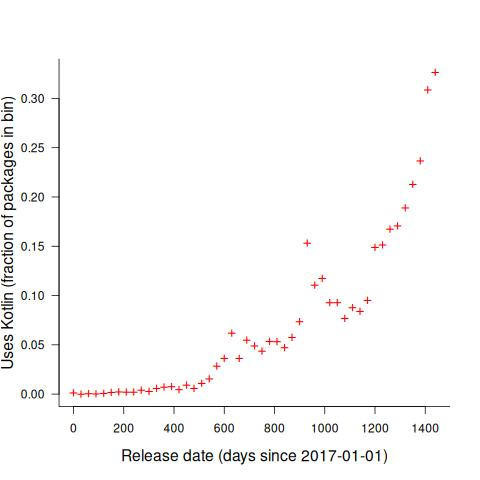
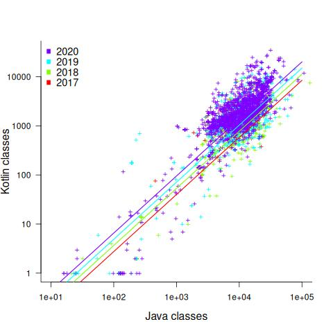
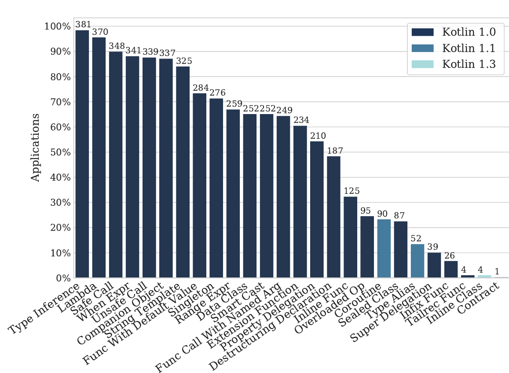
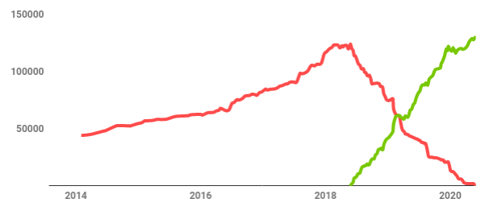

Package migration from Java to Kotlin
=====================================
:author:    Derek M. Jones
:email:    derek@knosof.co.uk
:copyright: Somebody
:backend:   slidy
:max-width: 45em

About me
--------

{nbsp}

Compiler front ends/code generators

{nbsp}

Source code analysis

{nbsp}

Industrial research in software engineering

{nbsp}

Finding me

* Twitter: @evidenceSE
* Discord: https://discord.gg/YV4RyKPr
* Github: https://github.com/Derek-Jones
* Blog: https://shape-of-code.com
* derek@knosof.co.uk
* London based

Book
----

Evidence-based Software Engineering based on the publicly available data

pdf+code+all data freely available +
http://knosof.co.uk/ESEUR

[caption="Figure ", label=ESEUR-Cover.jpg]
image::ESEUR-Cover.jpg[height=650,width=500,align="center"]

Overview
--------

{nbsp}

Patterns in language migrations

{nbsp}

Patterns in the data

{nbsp}

Possible futures

Patterns in language migrations
-------------------------------

C -> C++

* developers claiming to use C++
** using C++ comments, struct/class, malloc/new

C90 -> C99 -> C11 -> C17

* use of K&R C took 10+ years to 'die' out

C&#43;&#43;03 -> C&#43;&#43;11 -> C&#43;&#43;14 -> C&#43;&#43;17 -> C&#43;&#43;20

* a few studies of the growth of usage of particular new features
* Stroustrup: 'Evolving a language in and for the real world: C&#43;&#43; 1991-2006', +
              'Thriving in a Crowded and Changing World: C&#43;&#43; 2006–2020'
* 'Embracing modern C&#43;&#43; features: An empirical assessment on the KDE community' +
by Lucas,  Carvalho, Nunes, Bonifácio, João Saraiva, Accioly

{nbsp}

Java

*  'Understanding the use of lambda expressions in Java' +
by Mazinanian, Ketkar, Tsantalis, and Dig

Patterns in the data
--------------------

{nbsp}

Start of the language lifecycle

* 2017 Google announce first-class support for Kotlin on Android
* 2019 Google announce Kotlin is its preferred language

{nbsp}

Adoption of Kotlin features in Java Apps

* binaries from AndroZoo
* source code from GitHub

** Repo must contain both Java & Kotlin
** Star count of at least XX

Binary data
-----------

{nbsp}

'Quantifying the adoption of Kotlin on Android stores: Insight from the bytecode' +
Geoffrey Hecht and Alexandre Bergel

{nbsp}

201,721 APKs randomly chosen from AndroZoo (https://androzoo.uni.lu/)

* Jan 2017 - Dec 2020
* 191,623 Java only
* 10,098 (5%) Java+Kotlin

APKs using Kotlin
-----------------

APK release dates aggregated into 30 day bins

[caption="Figure ", label=package-uses-kotlin.jpg]

[small]'Quantifying the adoption of Kotlin on Android stores: Insight from the bytecode by Geoffrey Hecht Alexandre Bergel'

Java/Kotlin classes in APK
--------------------------

Regression model

* relationship between number of Kotlin classes and Java classes/APK date
* latexmath:[$Kotlin \approx Java^{1.16} e^{0.0008 days}$] : increasing at 33% per year

[caption="Figure ", label=kotlin-java-classes.jpg]

[small]'Quantifying the adoption of Kotlin on Android stores: Insight from the bytecode by Geoffrey Hecht Alexandre Bergel'

Source code data
----------------

'On the adoption, usage and evolution of Kotlin features in Android development' +
by Bruno Gois Mateus and Matias Martinez, 2020

387 Android apps (F-droid and AndroidTimeMachine->GitHub)

[caption="Figure ", label=kotlin-feature-usage.png]

[small]'On the adoption, usage and evolution of Kotlin features in Android development by Bruno Gois Mateus and Matias Martinez'

One project conversion
----------------------

Duolingo for Android

Converting from Java

* Run the IDE’s autoconverter
* Fix compilation errors
* Refactor

[caption="Figure ", label=duolingo-kotlin-java.png]

[small]'Migrating Duolingo’s Android app to 100% Kotlin by Art Chaidarun'
[small]'https://blog.duolingo.com/migrating-duolingos-android-app-to-100-kotlin/'

Possible futures
----------------

Google wants to lock-in developers

[caption="Figure ", label=kotlin-cult.jpg]

Ecosystem economics
-------------------

Is it worth learning Kotlin?

* career prospects
* employment outside Android ecosystem
* language popularity: hiring developers
* alternative choices
** Java
** Python

{nbsp}

Google ROI

* IBM and PL/1, DoD and Ada, Telecoms and CHILL
* Apple and Swift

Analyse your data?
------------------

{nbsp}

* Do you have any human related software engineering data? +
Jira repo, project schedules, etc

{nbsp}

* Free analysis of your data +
Provided I can publish an anonymized version of the data +
Renzo's Pomodoro data
[small]'https://shape-of-code.com/2019/12/15/the-renzo-pomodoro-dataset/'

{nbsp}

* derek@knosof.co.uk
* Twitter: @evidenceSE
* https://discord.gg/YV4RyKPr

